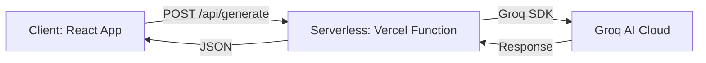

# Groq AI Integration Guide: MindEase Chatbot

This document explains how the Groq AI was integrated into the MindEase chatbot, specifically focusing on the serverless architecture and conversation memory.

## 🏗️ Architecture Overview

The system uses a **Serverless Architecture** to keep API keys secure and reduce frontend complexity.



### 1. Frontend: `src/services/mindEaseService.js`

The frontend doesn't talk to Groq directly. Instead, it sends the user message and conversation history to an internal endpoint. This protects your `GROQ_API_KEY` from being exposed in the browser.

### 2. Backend: `api/generate.js`

A Vercel-style serverless function (Node.js) that:

- Prepares the **System Prompt** (personality).
- Formats the **Conversation History**.
- Calls the Groq SDK with the `llama-3.1-8b-instant` model.

---

## 🧠 Memory Mechanism

MindEase uses **Contextual Memory**, allowing it to remember what was said earlier in the chat.

### How it's stored

1. **Local State**: The `messages` are stored in the React `messages` state in `App.jsx`.
2. **Persistence**: The chat history is saved to `localStorage`, so memory persists across page refreshes.

### How it's passed to AI

When a user sends a message, the `mindEaseService.js` sends the current message plus an array of `history` to the backend.

```javascript
// Example Payload
{
  "message": "What is my name?",
  "tone": "gentle",
  "history": [
    { "sender": "user", "text": "My name is Diya." },
    { "sender": "bot", "text": "Hello Diya! How can I help?" }
  ]
}
```

The serverless function then maps this history to the format Groq expects:

```javascript
// api/generate.js mapping
const recentHistory = history.slice(-4).map((msg) => ({
  role: msg.sender === "user" ? "user" : "assistant",
  content: msg.text,
}));
```

---

## 🚀 How to Reuse This Setup

### 1. Prerequisites

- Install the Groq SDK: `npm install groq-sdk`
- Have a Groq API Key from [console.groq.com](https://console.groq.com/)

### 2. Setup Environment Variables

- **Local**: Add `GROQ_API_KEY=your_key_here` to your `.env` file.
- **Production (Vercel)**: Add `GROQ_API_KEY` in the Project Settings > Environment Variables.

### 3. Files to Copy

- `api/generate.js`: The backend handler.
- `src/services/mindEaseService.js`: The frontend interface.

### 4. Run Locally

To run both the frontend and the backend together, use:

```bash
vercel dev
```

---

## 🛡️ Security Note

**Never commit your `.env` file.** The reason we use `api/generate.js` is to ensure your `GROQ_API_KEY` is only used on the server side (`process.env.GROQ_API_KEY`).
